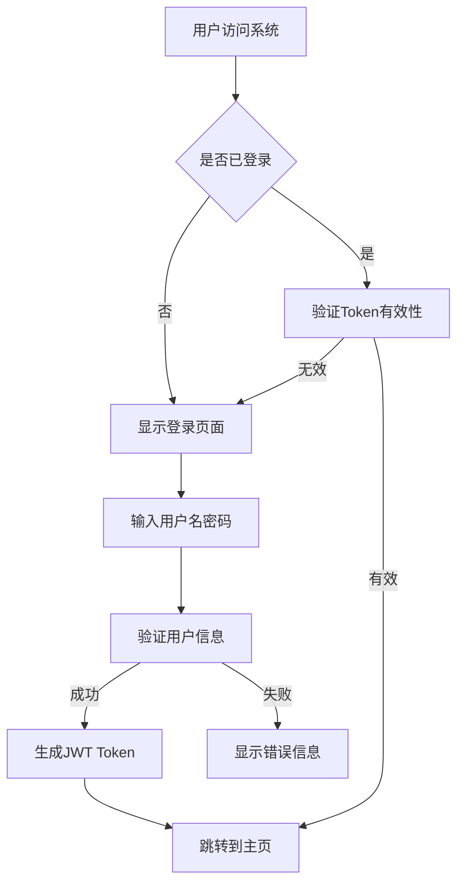
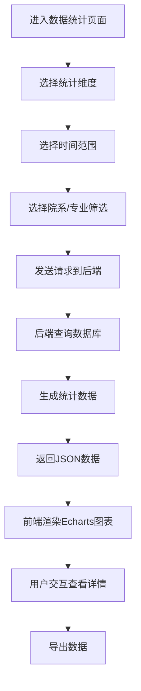
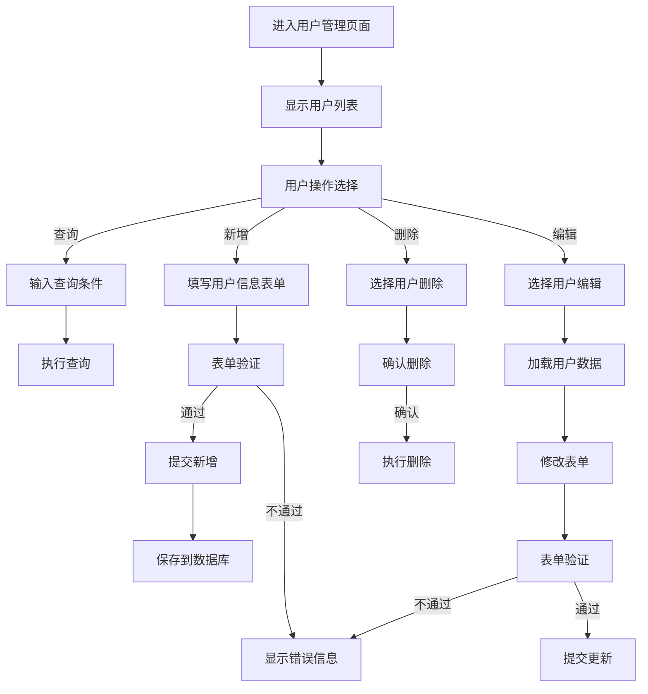
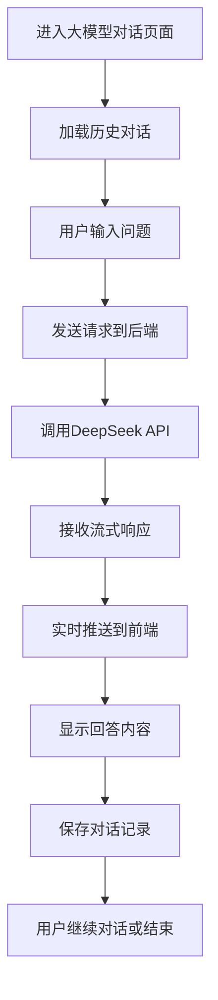
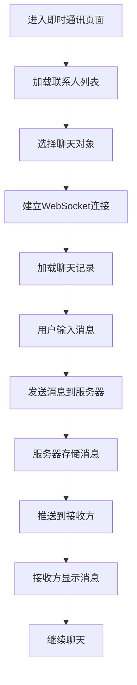

# SpringBoot师生助手系统 - 业务流程与产品设计

## 1. 用户角色与权限设计

### 1.1 用户角色定义
- **系统管理员**: 拥有所有权限，负责系统维护和用户管理
- **教师**: 可以管理自己的学生信息，查看统计数据，使用大模型助手和即时通讯
- **学生**: 可以查看自己的信息，使用大模型助手和即时通讯

### 1.2 权限矩阵
| 功能模块 | 系统管理员 | 教师 | 学生 |
|---------|-----------|------|------|
| 数据统计 | 全部数据 | 院系数据 | 个人数据 |
| 用户管理 | 全部 | 自己的学生信息 | 个人信息 |
| 大模型对话 | 无限制 | 无限制 | 无限制 |
| 即时通讯 | 可与所有人 | 可与学生/同事 | 可与教师/同学 |

## 2. 核心业务流程

### 2.1 用户认证流程


### 2.2 数据统计业务流程


### 2.3 CRUD操作流程


### 2.4 大模型对话流程


### 2.5 即时通讯流程


## 3. 页面导航与信息架构

### 3.1 整体导航结构
```
师生助手系统
├── 首页/仪表盘
├── 数据统计
│   ├── 用户活跃度
│   ├── 师生比例
│   ├── 专业分布
│   └── 对话量统计
├── 用户管理
│   ├── 教师管理
│   ├── 学生管理
│   └── 权限管理
├── 大模型助手
│   ├── 对话界面
│   ├── 历史记录
└── 即时通讯
    ├── 联系人列表
    ├── 聊天界面
```

### 3.2 页面跳转逻辑
1. **登录后**: 默认进入数据统计页面(仪表盘)
2. **顶部导航**: 四个主要功能模块的快速切换
3. **面包屑导航**: 显示当前位置，支持快速返回上级
4. **侧边栏导航**: 各模块内部子功能导航

## 4. 关键交互设计

### 4.1 数据统计页面交互
- **图表联动**: 点击图表某部分，其他图表相应更新
- **时间范围选择**: 提供快捷选项(今天、本周、本月)和自定义日期选择
- **数据钻取**: 支持从概览数据钻取到详细数据
- **图表切换**: 同一数据指标支持多种图表类型切换

### 4.2 CRUD操作交互
- **批量操作**: 支持多选后批量删除、批量修改
- **快速搜索**: 顶部搜索框支持实时搜索
- **行内编辑**: 直接在表格中编辑简单字段
- **操作确认**: 危险操作(如删除)需要二次确认

### 4.3 大模型对话交互
- **消息流式显示**: 大模型回答实时逐字显示
- **代码高亮**: 自动识别代码并高亮显示
- **消息操作**: 支持复制、点赞、收藏等操作

### 4.4 即时通讯交互
- **消息状态**: 显示发送中、已发送、已读状态
- **输入提示**: 显示"对方正在输入..."
- **消息类型**: 支持文本、图片、文件等多种类型
- **消息提醒**: 未读消息红点提醒和系统通知

## 5. 异常处理与边界情况

### 5.1 网络异常处理
- **请求超时**: 显示友好提示，提供重试按钮
- **断网重连**: 自动检测网络状态，恢复后重新请求数据
- **离线提示**: 明确告知用户当前网络状态

### 5.2 数据异常处理
- **无数据状态**: 显示友好的空状态提示
- **数据加载失败**: 提供刷新按钮
- **大模型API异常**: 提供备用回答或重试选项

### 5.3 权限异常处理
- **无权限访问**: 显示无权限提示，返回上一页
- **登录过期**: 自动跳转到登录页面
- **操作权限不足**: 禁用相关操作按钮并提示

## 6. 性能优化策略

### 6.1 前端优化
- **懒加载**: 非首屏内容延迟加载
- **虚拟滚动**: 大数据列表使用虚拟滚动
- **缓存策略**: 合理使用浏览器缓存
- **代码分割**: 按路由分割代码，减少首屏加载时间

### 6.2 后端优化 (Demo版本简化)
- **数据库优化**: 合理设计索引，优化查询语句
- **无缓存策略**: 完全不使用缓存，简化系统架构
- **异步处理**: 仅大模型API调用使用异步处理
- **连接池**: 使用Spring Boot默认数据库连接池配置


## 7. 安全设计

### 7.1 认证安全
- **密码加密**: 使用BCrypt加密存储密码
- **Token安全**: JWT Token设置合理过期时间
- **登录限制**: 登录失败次数限制

### 7.2 数据安全
- **敏感数据**: 敏感信息加密存储
- **SQL注入**: 使用参数化查询防止SQL注入
- **XSS防护**: 前端输入输出过滤

### 7.3 接口安全
- **接口鉴权**: 所有接口验证用户权限
- **请求限流**: 防止恶意请求
- **参数校验**: 严格校验输入参数

## 8. 用户体验设计原则

### 8.1 界面设计原则
- **一致性**: 保持整体风格和交互一致性
- **简洁性**: 界面简洁明了，避免冗余元素
- **反馈性**: 操作后及时给予反馈
- **容错性**: 允许用户犯错并提供恢复机制

### 8.2 交互设计原则
- **可预测性**: 用户能预测操作结果
- **可控性**: 用户可以控制和撤销操作
- **效率性**: 减少用户操作步骤
- **可访问性**: 考虑不同用户群体的使用需求